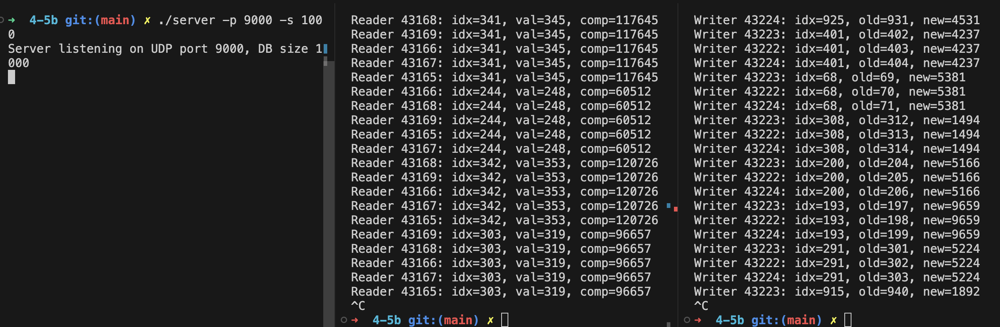

## 1. Исполнитель

Тулинов Тимофей Антонович, группа БПИ236

## 2. Условие задачи

**Вариант 7**
Задача о читателях и писателях («подтвержденное чтение»).
Базу данных, представленную массивом целых положительных чисел, разделяют два типа процессов: N читателей и K писателей. Читатели периодически просматривают случайные записи базы данных и выводят номер свой номер (например, PID), индекс записи, ее значение, а также вычисленное значение, которое является произведением числа на номер записи. Писатели изменяют случайные записи на случайное число и также выводят информацию о своем номере, индексе записи, старом значении и новом значении. Предполагается, что в начале БД находится в непротиворечивом состоянии (все числа отсортированы). Каждая отдельная новая запись переводит БД из одного непротиворечивого состояния в другое (то есть, новая сортировка может поменять индексы записей или переставить числа). Транзакции выполняются в режиме «подтвержденного чтения», то есть процесс-писатель не может получить доступ к БД в том случае, если ее занял другой процесс–писатель или процесс–читатель. К БД может обратиться одновременно сколько угодно процессов–читателей. Процесс читатель получает доступ к БД, даже если ее уже занял процесс–писатель.

---

Создать клиент–серверное приложение с процессами–писателями и процессами–читателями.
Сервер моделирует базу данных. Все писатели и все читатели — два разных клиента, в каждом из которых возможна конкуренция параллельных процессов или потоков. Каждый процесс это отдельный писатель или отдельный читатель внутри сервера.


## 3. Описание программы

 В этой системе сервер моделирует базу данных как упорядоченный массив целых чисел (`std::vector<int> db`), запущенный командой `./server -p PORT -s DB_SIZE`. Клиенты–читатели (`reader_client.cpp`) и клиенты–писатели (`writer_client.cpp`) запускаются отдельно, каждый порождает N или K процессов через `fork()`, которые в цикле отправляют UDP-запросы на сервер. Процесс-читатель шлёт запрос типа «read» с PID и случайным индексом, получает обратно значение и вычисленное произведение индекса на значение; процесс-писатель шлёт запрос типа «write» с PID, индексом и новым значением, получает старое и новое значение после сортировки массива. Все сетевые параметры (IP и порт) задаются в командной строке для гибкости в разных сетевых условиях.

На сервере каждый запрос обрабатывается в отдельном потоке: для чтения используется мьютекс подсчёта читателей (`mtx_readcount`) и условная переменная (`cv_readers_done`), позволяющие нескольким читателям одновременно смотреть данные, не блокируя друг друга; после чтения уменьшается счётчик и при нулевом значении уведомляется ожидающий писатель. Для записи используется эксклюзивная блокировка (`mtx_writer`), а писатель ждёт, пока текущие читатели не закончат работу, затем обновляет запись, выполняет полную сортировку массива и отправляет ответ. Такой подход гарантирует «подтверждённое чтение»: писатели не вмешиваются в активные чтения, а читатели не блокируют друг друга и могут заходить в базу даже при наличии ожидания писателя.

## 4. Архитектура

Сетевая архитектура выстроена по схеме «звезда»: все клиенты (читатели и писатели) напрямую взаимодействуют с одним или несколькими серверами базы данных через UDP. При развёртывании каждый узел (сервер или клиент) запускается как отдельный процесс на одной или нескольких машинах, при этом адрес сервера и порт задаются в командной строке для гибкой настройки в любой сети. Клиентская часть делится на две программы — читательскую и писательскую — каждая из которых порождает нужное число процессов через `fork()`. Процессы-читатели и процессы-писатели работают независимо, посылая запросы на сервер, при этом не требуется согласованное состояние между клиентами: весь порядок и синхронизация поддерживаются на сервере.

Внутри сервера заложена модульная логика:  
- **Модуль хранения** оперирует упорядоченным вектором (`std::vector<int> db`), хранящим данные.  
- **Модуль синхронизации** использует два мьютекса (`mtx_readcount`, `mtx_writer`) и условную переменную (`cv_readers_done`), чтобы обеспечить «подтверждённое чтение»: множество читателей работают параллельно, а писатель ждёт, пока все они не завершат операции.  
- **Сетевой модуль** организует приём-запуск потоков-обработчиков на каждое UDP-сообщение и отправку ответов клиентам.  

Каждый входящий запрос обрабатывается в отдельном `std::thread`, что позволяет масштабировать обработку при росте числа клиентов, сохраняя чёткое разграничение ответственности между чтением и записью данных.

## 5. Формат командной строки

```
g++ -std=c++17 -pthread server.cpp   -o server
g++ -std=c++17           reader_client.cpp -o reader_client
g++ -std=c++17           writer_client.cpp -o writer_client


./server -p 9000 -s 1000
./reader_client -h 127.0.0.1 -p 9000 -n 5
./writer_client -h 127.0.0.1 -p 9000 -k 3
```

  ## 6. Тесты

  
****